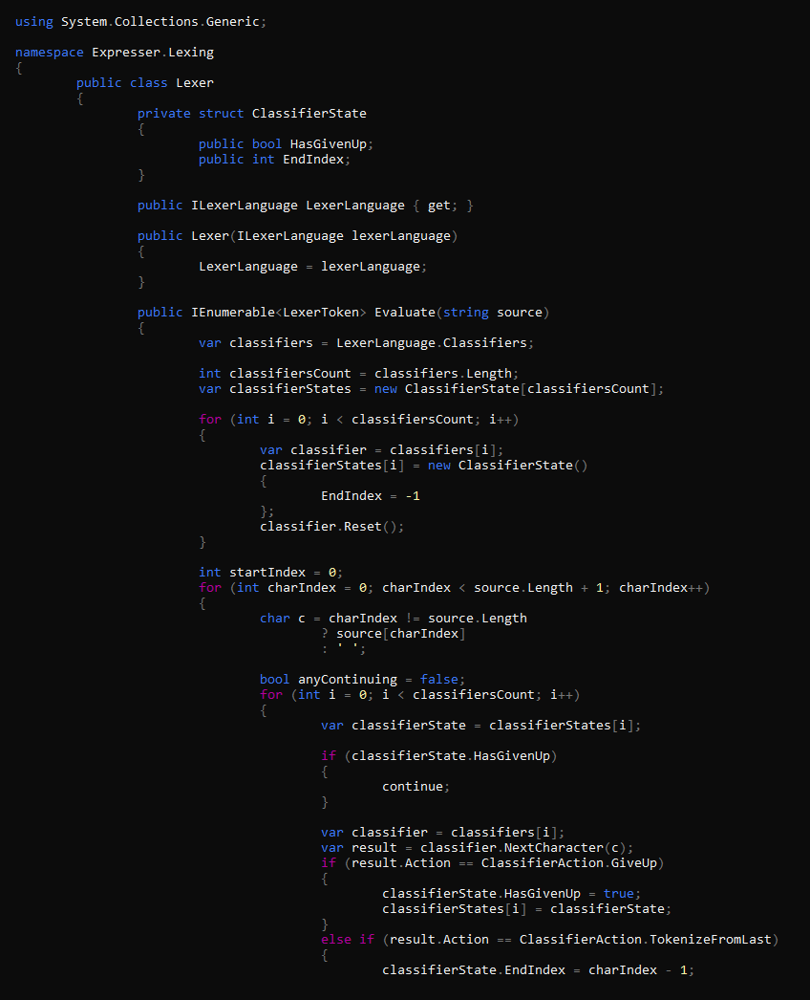
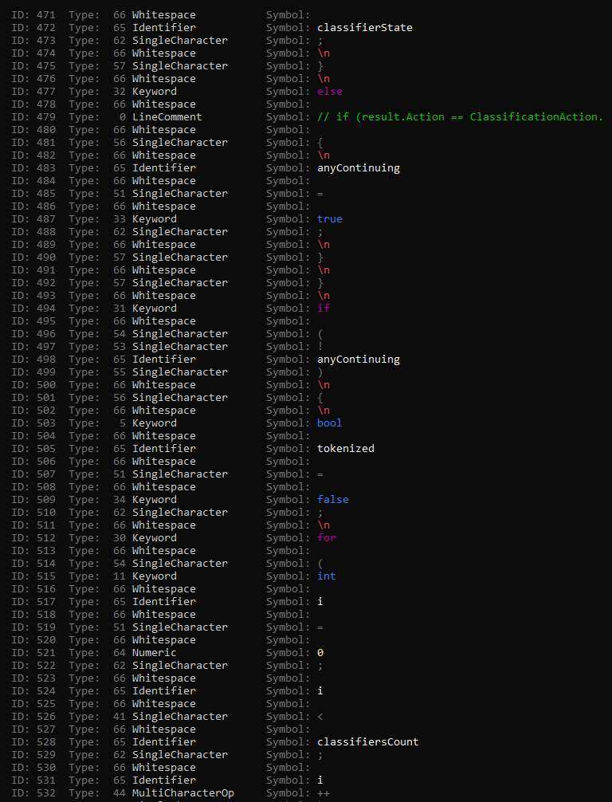
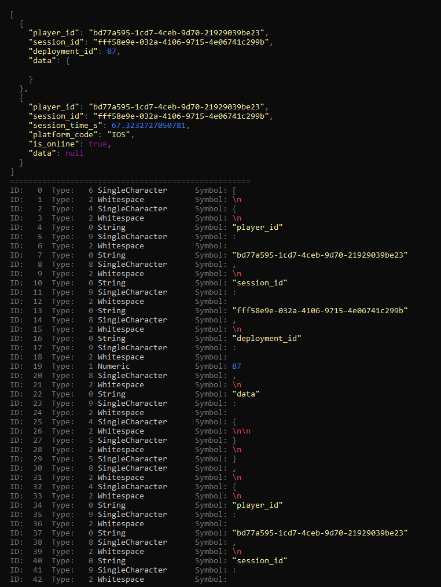
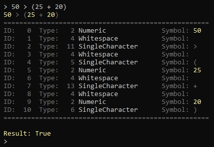
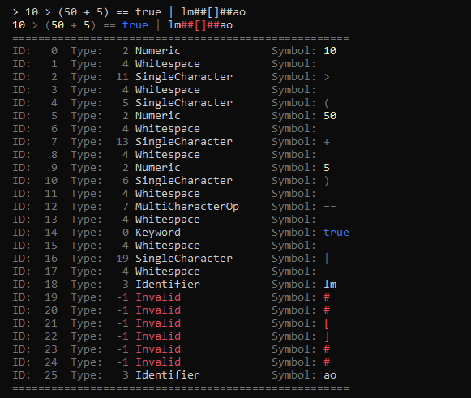

# Expresser

[](https://www.nuget.org/packages/expresser) [](https://www.nuget.org/packages/expresser)\
[](https://github.com/Fydar/Expresser/issues?q=is%3Aissue+is%3Aopen+label%3Atodo)
[](https://github.com/Fydar/Expresser/issues?q=is%3Aissue+is%3Aopen+label%3Abug)

At the moment, just a modular C# DSL Lexer library.

[](https://github.com/Fydar/Expresser/wiki/Expresser)

## Expresser.Lexing

The Expresser lexing (tokenisation) library. Expresser also has simple (but not complete) Lexers for C# and Json in `Expresser.Lexing.Demo`, as shown below.

### C# Lexer





### Json Lexer



## Expresser.Language.SimpleMath

Expresser contains a simple mathmatics DSL that supports a basic set of operators.

```csharp
using System;
using Expresser.Language.SimpleMath;
using Expresser.Language.SimpleMath.Input;

public class Program
{
    public static void Main(string[] args)
    {
        var context = new MathContextBuilder()
            .WithTerm("Width", new StaticValueProvider(10))
            .Build();

        var expression = new SimpleMathExpression("0.1 * Width", context);

        var result = expression.Evaluate();

        Console.WriteLine (result.ValueClass); // ValueClassifier.Float
        Console.WriteLine (result.FloatValue); // 1
    }
}
```

### REPL Demo

The REPL demo can be used to quickly test additions and alterations to the SimpleMath language.



Invalid characters are highlighted in red.



## Contributing

[](https://gitmoji.carloscuesta.me)

This project follows commit guidelines specified by [Gitmoji](https://gitmoji.carloscuesta.me), with the exception of using the raw unicode character (✨) rather than a string (`:sparkles:`). This is to increase compatibility with Git clients.

Commit messages should target around a 50 character long headline, with any addition information following two line breaks. [Fork](https://git-fork.com/) uses this format when you are writing your commit messages.

Feel free to submit pull requests, referencing any relevant issues and listing a brief overview of the changes in the pull request.

### Code Style

An `.editorconfig` is included in the project that will ensure that your IDE follows the projects code style. I recommend you use an IDE that supports `.editorconfig` files such as [Visual Studio](https://visualstudio.microsoft.com/).

## License

[](https://github.com/Fydar/Expresser/blob/master/LICENSE)

This work is licensed under the **Apache License, Version 2.0**, meaning you are free to use this work commercially under the conditions the `LICENSE` and `NOTICE` files are included within the source.
